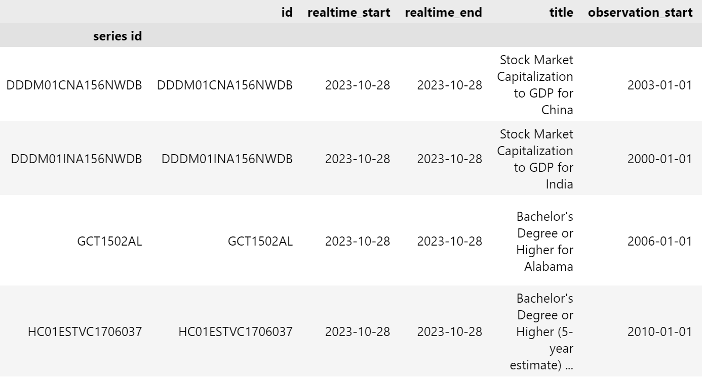

# Overview

Here is the link to the S&P 500 data set: https://fred.stlouisfed.org/series/SP500

The reason I wanted to do this project, was because I have always been interested in doing some form of data analysis in the future, and wanted to pollish some of my skills. This was a nice way for me to brush up on those skills and practice learning something new to me.

[Software Demo Video](https://youtu.be/Ia7G_68Pgnc)

# Data Analysis Results

# Question 1: What are the series results from the S&P ordered by popularity? Filter these results by observation start date of after the year 2000, and make sure that the results are Annual, not monthly or daily. This will help identify which data sets I want to work with.

## Answer 1:

# Question 2: How many data points are in the two data series?

## Answer 2: Number of Data points in S&P 500:2518 , Number of Data Points in Unemployment Rate SD: 404

# Development Environment

I used Python and Kaggle to do most of this project. I used pandas in order to perform the count for question #2 and I used matplotlib in order to plot the graphs. I used kaggle especially to make the API key function properly, as it wasn't working correctly when I was just trying to do this in VScode.

# Useful Websites

* [towardsdatascience.com](https://towardsdatascience.com/getting-started-to-data-analysis-with-python-pandas-with-titanic-dataset-a195ab043c77)
* [kaggle.com](https://www.kaggle.com/code/spscientist/a-simple-tutorial-on-exploratory-data-analysis)

# Future Work

* I need to for sure try and fix the graph that I combined both data sets and the correlation was -0.08, I think I messed it up a little bit, but I did not have time to finish tinkering with it.
* I want to really do some more in depth analysis of these data series so that I can glean more interesting results.
* I want to maybe combine one more other interesting data series with the two existing ones, in order to make a strong correlation.